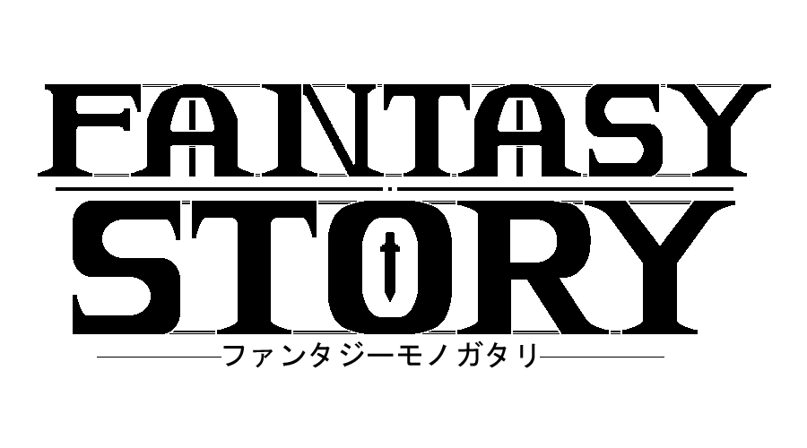

### Hi there 

> ###### My name is *Allen* (or *Aren*). I am a game developer. I make stuff sometimes. 
> Check out my game !

---
###  Current Projects 

[![FantasyStoryLogo][fantasyStoryLogoBlk]][fantasyStorySteamPage]

    
    

 

> A fast paced Action Platformer set in a high fantasy universe. 
>[![Steam Badge][fantasyStorySteamBadge]][fantasyStorySteamPage]
>[![Itch Badge][fantasyStoryItchBadge]][fantasyStoryItchPage]

[![Logo][puzzleMuseumLogo]][puzzleMuseumWebsite]

    
    

> An educational puzzle game with a cute cat aesthetic. Working with *Alunite, Inc.*
---
### Blog posts 
<!-- BLOG-POST-LIST:START -->
- [Sleep, passivity, rest — these are all things which are neglected due to a fear of nothingness.](https://www.reddit.com/r/u_ArenDev/comments/lxekn7/sleep_passivity_rest_these_are_all_things_which/)
- [Anatomy of a Status Window](https://www.reddit.com/r/u_ArenDev/comments/kq9uxj/anatomy_of_a_status_window/)
<!-- BLOG-POST-LIST:END -->

<!-- References -->
[fantasyStoryLogoBlk]: https://allenoliver.github.io/FantasyStory/images/logo_dark.png

[fantasyStorySteamPage]: https://store.steampowered.com/app/1264840/Fantasy_Story/

[fantasyStorySteamBadge]: https://img.shields.io/badge/Steam-Check%20it!-red?style=plastic&logo=steam

[fantasyStoryItchPage]: https://keigames.itch.io/fantasy-story

[fantasyStoryItchBadge]: https://img.shields.io/badge/itch.io-Check%20it!-red?style=plastic&logo=itch.io

[puzzleMuseumLogo]: https://images.squarespace-cdn.com/content/v1/5ee0db6d27cc552b9ab12ab6/1606486316399-G6AYI7XBX2URTOXNSL1W/ke17ZwdGBToddI8pDm48kH3Q8TjQNHoGSBCBu-WKmJJ7gQa3H78H3Y0txjaiv_0fDoOvxcdMmMKkDsyUqMSsMWxHk725yiiHCCLfrh8O1z5QPOohDIaIeljMHgDF5CVlOqpeNLcJ80NK65_fV7S1UesK-rXRrrWPYlj-RLsCyCzPrMqu8tDvN8Ak6bXTozbdH3bqxw7fF48mhrq5Ulr0Hg/puzzle+museum+title.png

[puzzleMuseumWebsite]: https://www.alunite.jp/puzzle-museum